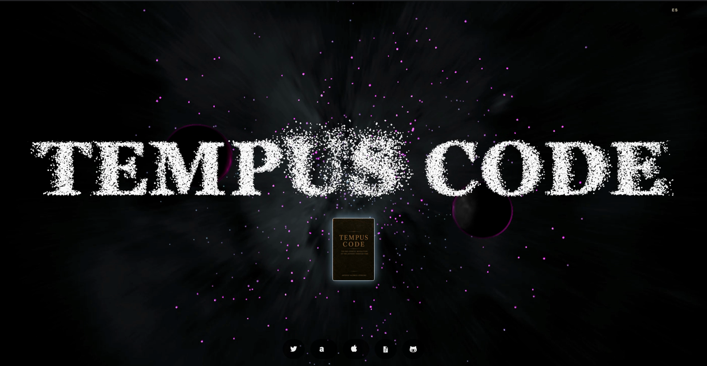
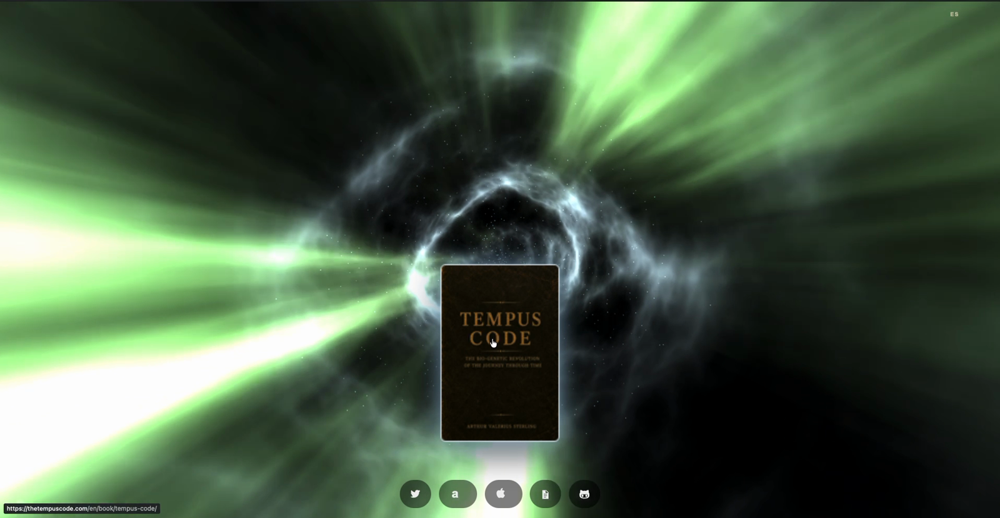
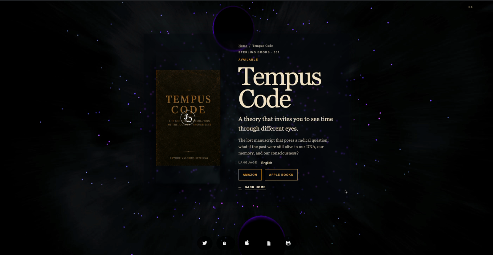

# Bilingual Astro Editorial Template

<p align="center">
  <strong>A cinematic, bilingual landing page for books, portfolios, and editorial projects.</strong><br />
  Astro · TypeScript · Static output · Spanish / English
</p>

<p align="center">
  <a href="https://github.com/EloyEMC/bilingual-astro-editorial-template/actions"></a>
  <a href="https://astro.build"></a>
  <a href="LICENSE"></a>
  <a href="https://github.com/EloyEMC/bilingual-astro-editorial-template/stargazers"></a>
</p>

<p align="center">
  
</p>

## What the template does

This is a **bilingual Astro starter for cinematic editorial websites**: book launches, author portfolios, creative studios, and narrative projects. It generates a fast static site with no CMS, database, or runtime API required.

The template gives you the page structure and visual system; you replace the example data, artwork, links, and legal copy with your own project.

This project is based on Astro's [Space theme](https://astro.build/themes/details/space/).

**Keywords:** Astro template · bilingual website · editorial design · book website · portfolio starter · Three.js · WebGL · static site · i18n · responsive landing page

### What visitors see

The homepage is designed as an immersive entry point:

1. A full-screen dark space scene provides the visual background.
2. A large particle-based title appears over the scene and reacts to pointer movement.
3. A floating cover or project image acts as the primary entry point.
4. The lower action row provides localized purchase, legal, and attribution links.
5. The language switcher lets visitors move between `/es/` and `/en/` without losing context.

The detail route then turns the same visual language into a readable editorial page with a cover, title, description, calls to action, metadata, and responsive layout. On reduced-motion or unsupported-WebGL devices, semantic text and static fallbacks remain available.

### Included capabilities

- localized `/es/` and `/en/` routes;
- static Astro generation with canonical and alternate-language metadata;
- book or project landing pages with responsive layouts;
- immersive WebGL background and particle-title effects;
- localized legal, cookie, and third-party attribution pages;
- accessible navigation, focus states, reduced-motion support, and responsive fallbacks.

## See it in action

The production site [`thetempuscode.com`](https://thetempuscode.com) is the live demo of the experience this template is designed to produce. The repository keeps generic example data so you can replace the branding, copy, and artwork with your own project.

### Screenshots from the live demo

<p align="center">
  
</p>

<p align="center">
  
</p>

<p align="center">
  
</p>

Additional generic previews are available in [`docs/preview.svg`](docs/preview.svg) and [`docs/book-preview.svg`](docs/book-preview.svg).

### Video demo

[](https://www.youtube.com/watch?v=6i7_l1JIzZc)

## Quick start

```bash
npm install
npm run dev
```

Then open `http://localhost:4321/es/` or `http://localhost:4321/en/`.

Before deploying:

1. Replace the example content in [`src/data/books.ts`](src/data/books.ts).
2. Replace the legal examples in [`src/data/legal.ts`](src/data/legal.ts).
3. Replace `public/media/template-cover-*.svg` with artwork you are allowed to publish.
4. Set your production origin in [`astro.config.mjs`](astro.config.mjs).
5. Review [`THIRD_PARTY_NOTICES.md`](THIRD_PARTY_NOTICES.md).

## Project map

| Path | Purpose |
| --- | --- |
| `src/data/` | Localized editorial, legal, and attribution content |
| `src/pages/` | Static route definitions for both locales |
| `src/layouts/` | Shared HTML shell and SEO integration |
| `src/components/` | Reusable consent, SEO, and presentation components |
| `src/styles/` | Site-wide visual system and responsive rules |
| `src/scripts/` | Interactive scene and particle effects |
| `public/media/` | Replaceable example artwork |
| `THIRD_PARTY_NOTICES.md` | Upstream credits and license requirements |

## Commands

| Command | Purpose |
| --- | --- |
| `npm run dev` | Start the local development server |
| `npm run check` | Run Astro and TypeScript diagnostics |
| `npm run build` | Generate the production site in `dist/` |
| `npm run preview` | Preview the production build locally |

## Attribution and license

The template-owned scaffolding is released under the [MIT License](LICENSE). The Wormhole Extreme scene and three.js remain subject to their own licenses and attribution requirements; read [`THIRD_PARTY_NOTICES.md`](THIRD_PARTY_NOTICES.md) before redistributing a customized version.

## Contributing

Issues and pull requests are welcome when they improve the generic template rather than adding private project content. Keep examples fictitious, accessible, bilingual where relevant, and safe to publish.
